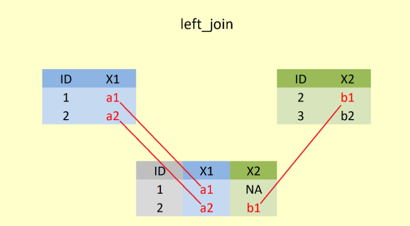
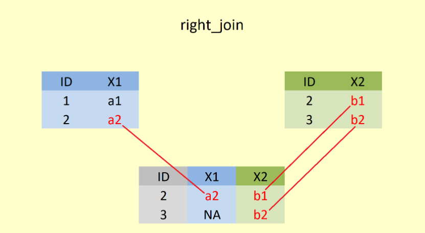
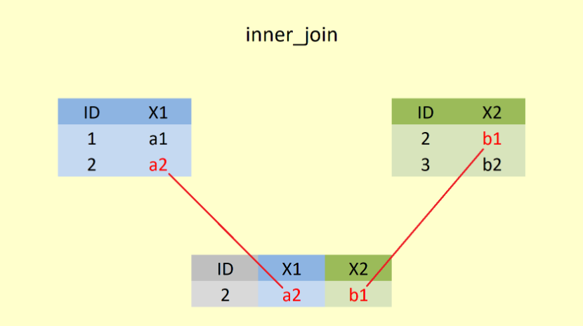
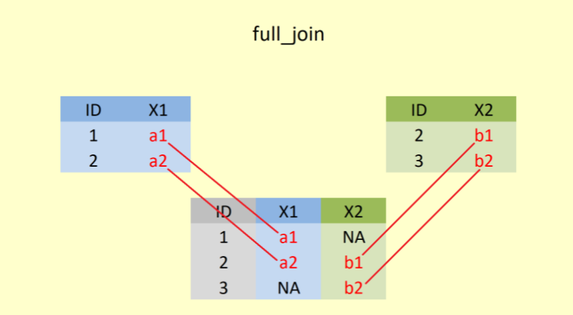
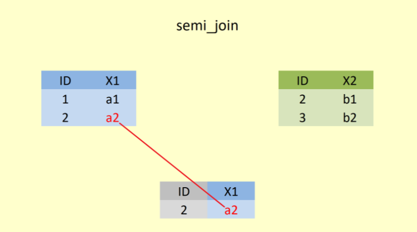

```{r child = "../setup.Rmd"}
```

```{r set-theme, include=FALSE}
library(xaringanthemer)
style_duo_accent(
  primary_color      = "#0F4C81", # pantone classic blue
  secondary_color    = "#B6CADA", # pantone baby blue
  header_font_google = google_font("Raleway"),
  text_font_google   = google_font("Raleway", "300", "300i"),
  code_font_google   = google_font("Source Code Pro"),
  text_font_size     = "30px"
)
```


```{r load-packages, include=FALSE, message=FALSE, warning=FALSE}
library(tidyverse)
library(dplyr)
library(tuev)


```

# join data .huge[`r emo::ji("stats")`]

.hand[İçerik...]
- **join()** fonksiyonlari
- **left_join()**
- **right_join()**
- **full_join()**
- **inner_join()**
- **semi_join()**
- **anti_join()**

---
## **join()** fonksiyonu

- **join()** fonksiyonları iki veri setini istenilen şekilde birleştirme amacıyla kullanılırlar.

- **A** ve **B** veri setlerini birleştirmek istediğimizde 

  - Her iki veri setinden de hangi **satırları** almak istiyoruz?

  - Her iki veri setinden de hangi **sütunları** almak istiyoruz?

  - Satırların **eşleşip eşleşmeyeceğini** hangi değişkenlerle belirleyeceğiz?

---

## Join Türleri

Çok sayıda **join()** fonksiyonu bulunmaktadır. <sup>1</sup>...
.pull-left[
- **A %>% left_join(B)**
<br>
`A` dan tüm satırları, mümkün olduğunda `B` ile eşleştir (olmadığında "NA" verir), hem `A` hem de `B` den gelen sütunları alır.

```{r echo=FALSE, fig.align='center',out.width="75%"}

```
]

--

.pull-right[
- **A %>% right_join(B)**
<br>
`B` den tüm satırları, mümkün olduğunda `A` ile eşleştir (olmadığında "NA" verir), hem `A` hem de `B` den gelen sütunları alır.

```{r echo=FALSE, fig.align='center', out.width="75%"}

```
  - .small[[1] Pratikte genellike **left_join()** kullanılır.]
]

---

## Join Türleri

<br>

.pull-left[

- **A %>% inner_join(B)**
<br>
yanlızca `A` ve `B` nin eşleşen satırlarını birleştirir. Hem `A` hem de `B` den gelen sütunları alır.

```{r echo=FALSE, fig.align='center',out.width="75%"}

```
]

--

.pull-right[

- **A %>% full_join(B)** 
<br>
`A` ve `B` den tüm satırları birleştirir. Hem `A` hem de `B` den gelen sütunları alır.

```{r echo=FALSE, fig.align='center',out.width="75%"}

```
]

---

## Join Türleri

.pull-left[

<br>

- **A %>% semi_join(B)**
<br>
`A` nın `B` ile eşleşen satırlarını alır.  Sadece `A` dan gelen sütunları alır.

```{r echo=FALSE, fig.align='center',out.width="75%"}

```
]

--

.pull-right[


<br>

-  **A %>% anti_join(B)**
<br>
`A` nın `B` ile eşleşemeyen satırlarını alır. Sadece `A` dan gelen sütunları alır.

```{r echo=FALSE, fig.align='center',out.width="75%"}

```
]
---
## Join Türleri

- Aynı değerleri içeren satırların olduğu sütunların *eşleşmesi* gerektiğini söylüyoruz.

- Bunları birleştirme için bir **by =** argümanını kullanıyoruz.

- Eğer birleştirme yapmak istediğimiz sütun/ların isimleri aynı ise **by =** argümanını kullanmaya gerek yoktur. 


---
.center[## left_join & right_join]
.pull-left[
cinsiyet1
```{r include =FALSE}
cinsiyet1 <- 
data.frame(ogrenci = c("Mert Kaya", "Zeynep Turan", "Zeynep Inal"),
           cinsiyet = c("Erkek", "Kiz", "Kiz"))
cinsiyet2 <- 
data.frame(ogrenci = c("Mert Kaya", "Zeynep Turan", "Zeynep Inal"),
           cinsiyet = c("Erkek", "Kiz", "Kiz"))

# saveRDS(cinsiyet1,file="sunum/data/cinsiyet1.Rds")
# saveRDS(cinsiyet2,file="sunum/data/cinsiyet2.Rds")

```

```{r}
cinsiyet1
```
]

.pull-right[
kangrubu1
```{r include =FALSE}
kangrubu1 <- 
data.frame(ogrenci = c("Zeynep Turan", "Zeynep Inal","Can Eser"), 
kangrubu = c("A Rh(-)", "0 Rh (+)", "ARh(+)"))
kangrubu2 <- 
data.frame(ad = c("Zeynep Turan", "Zeynep Inal","Can Eser"), 
kangrubu = c("A Rh(-)", "0 Rh (+)", "ARh(+)"))
# saveRDS(kangrubu1,file="sunum/data/kangrubu1.Rds")
# saveRDS(kangrubu2,file="sunum/data/kangrubu2.Rds")
```

```{r}
kangrubu1
```
]
.pull-left[
```{r}
left_join(cinsiyet1,kangrubu1)
```
]
.pull-right[
```{r}
right_join(cinsiyet1,kangrubu1)
```
]


---
.center[## inner_join & full_join]

.pull-left[
cinsiyet1
```{r}
cinsiyet1
```
]

.pull-right[
kangrubu1
```{r}
kangrubu1
```

]
.pull-left[
```{r}
inner_join(cinsiyet1,kangrubu1)
```
]
.pull-right[

```{r}
full_join(cinsiyet1,kangrubu1)
```
]

---
.center[## semi_join & anti_join]

.pull-left[
cinsiyet1
```{r}
cinsiyet1
```
]

.pull-right[
kangrubu1
```{r}
kangrubu1
```

]
.pull-left[
```{r}
semi_join(cinsiyet1,kangrubu1)
```
]
.pull-right[

```{r}
anti_join(cinsiyet1,kangrubu1)
```
]

---
.center[## by argumani]

.pull-left[
cinsiyet1
```{r}
cinsiyet2
```
]

.pull-right[
kangrubu1
```{r}
kangrubu2
```

]
.pull-left[
```{r}
cinsiyet2 %>% 
left_join(kangrubu2,by=c("ogrenci"="ad"))
```
]
.pull-right[

```{r}
kangrubu2 %>% 
left_join(cinsiyet2,by=c("ad"="ogrenci"))
```
]


---
.center[## Kume Islemleri]

.pull-left[

```{r echo=FALSE, fig.align='center', out.width="70%"}
knitr::include_graphics("img/kumeislemleri.png")
```
]
.pull-right[
```{r}
intersect(1:5, 4:8)
union(1:5, 4:8)
setdiff(1:5, 4:8)
setdiff(4:8, 1:5)
```

]

---
## Aynı değisken adlari

```{r}
intersect(names(PISA_STU_2018), names(PISA_SCH_2018))
```

```{r}
intersect(names(PISA_STU_2018), names(PISA_COG_2018))
```

---
## join 

```{r}
miniOGR <- PISA_OGR_2018 %>% select(OKULID,OGRENCIID,CINSIYET,KITAPSAYISI,ST196Q02HA:ST196Q07HA)
miniOGR %>% head(2)
```

```{r}
miniSCH <- PISA_SCH_2015 %>% select(CNTSCHID,okulbuyukluk = SCHSIZE,sinifbuyuk= CLSIZE)
miniSCH %>% head(2)
```

---
## join 

- veri setinde eslestirme yapılması istenilen değişkenin farklı adları oldugunda 
```{r}
left_join(miniOGR,miniSCH,by=c("OKULID"="CNTSCHID"))
```

---

<br>

  <br>
<br>

- konu ile ilgili daha fazla alıştırma için [adresini](https://rpubs.com/williamsurles/293454) inceleyebilirsiniz.

.hand-large[teşekkürler !]

--


